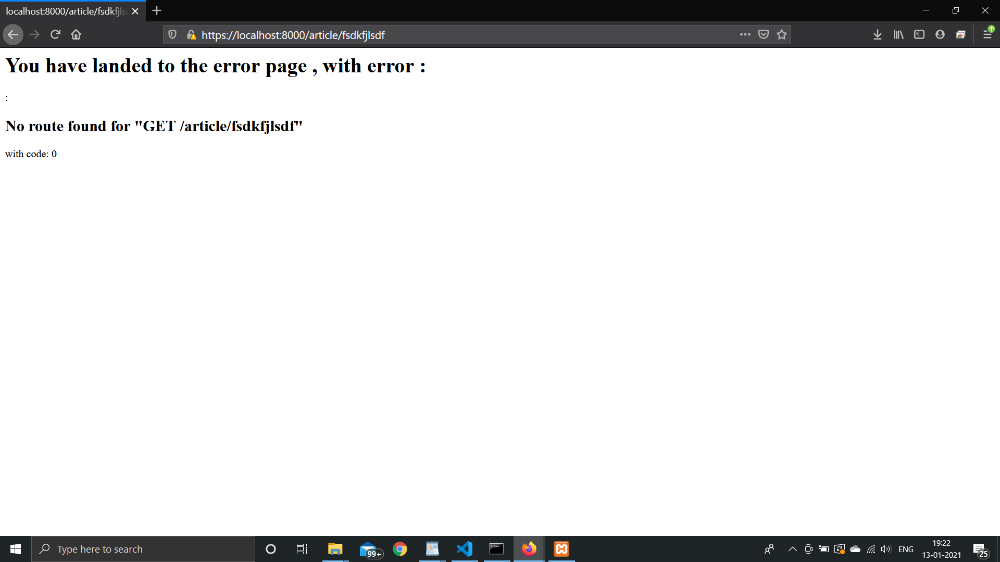
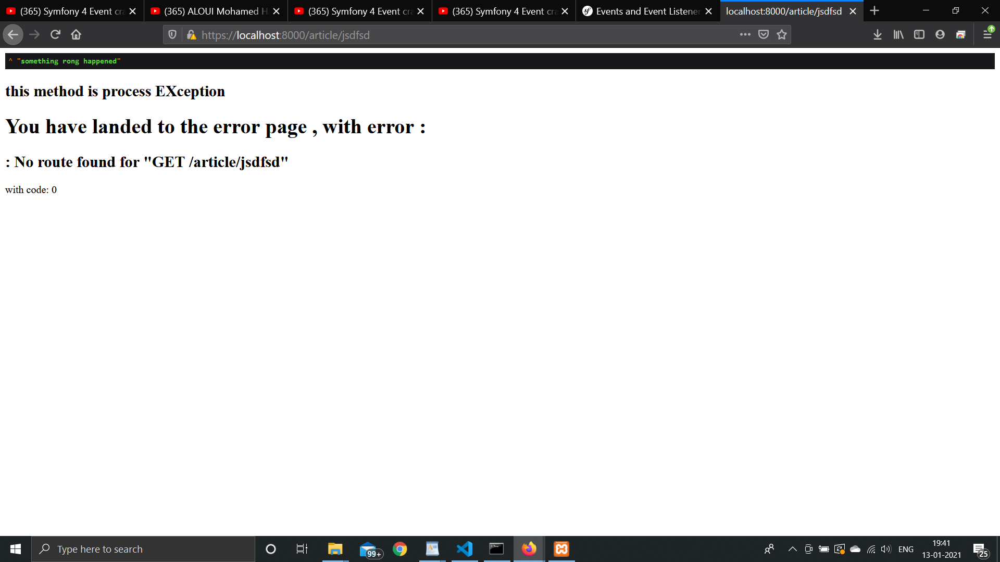
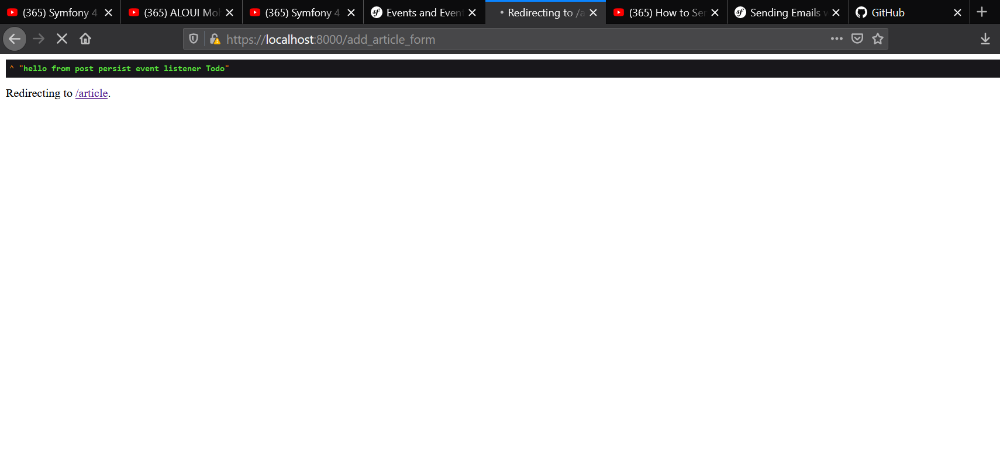
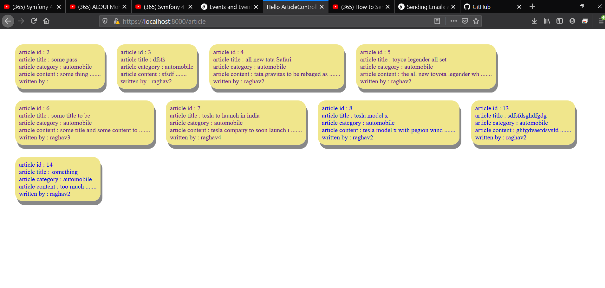

# event_listener_subscriber

following functionlity added

1) on tying some wrong url you will be redirected to some error page  as shown below 

2) on executing the event of postin g a post ie , postPersist dumping a message usingsubscriber :

and then reidrecting to show pages

